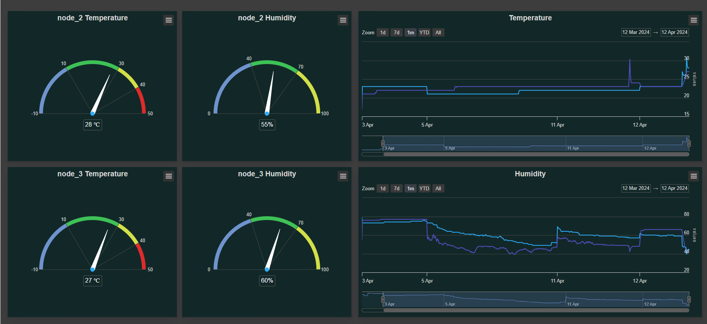

# LoRa-Mesh
A LoRa-mesh network of SX1276 ESP32 boards with DHT11 sensors for measuring temperature and humidity. The results are displayed on a dashboard. This project conducted as part of my studies in the School of Electrical and Computer Engineering at the National Technical University of Athens (NTUA).
## Project Explanation
The network consists of three LoRa nodes, two of which are connected to DHT11 sensors, while the third one is used as a bridge for sending MQTT messages using Mosquitto broker. The measurements are in JSON format and are stored in a MongoDB database.

LoRa boards were programmed using [Arduino IDE](https://www.arduino.cc/en/software) and the Dashboard was programmed using node.js and [Highchart libraries](https://www.highcharts.com/)

## Parts required
1. TTGO LORA32 868/915Mhz SX1276 ESP32 Oled-display Bluetooth WIFI Lora
2. DHT11
3. Breadboards
4. Jumper wires

## Arduino Libraries
Install the board in Arduino IDE using this [guide](https://randomnerdtutorials.com/installing-the-esp32-board-in-arduino-ide-windows-instructions/). 

Install the follownig libraries:
- [Adafruit_SSD1306 library](https://github.com/adafruit/Adafruit_SSD1306)
- [Adafruit_GFX library](https://github.com/adafruit/Adafruit-GFX-Library)
- ArduinoJson (from library manager of [Arduino IDE](https://docs.arduino.cc/software/ide-v1/tutorials/installing-libraries/))
- [Async MQTT Client Library](https://github.com/marvinroger/async-mqtt-client)
- [DHT sensor library](https://github.com/adafruit/DHT-sensor-library)
- [RadioHead](https://www.airspayce.com/mikem/arduino/RadioHead/index.html)

## LoRa configuration 
Program one board with [bridge.ino](/LoRa/bridge/bridge.ino) and the other two with [node.ino](/LoRa/node/node.ino) and [node_access_point.ino](/LoRa/node_access_point/node_access_point.ino). You can program additional nodes board by changing the address of the board (line 13). Every board should have a different address. The DHT sensor is connected to digital pin 4 of the board.

In the [bridge](/LoRa/bridge/bridge.ino) you need to set up:
- LoRa Mesh network (line 35)
- Wifi details (line 39)
- MQTT broker and topics (line 45 and 53)

The default interval time between each measurement is 10 seconds. You can also change the interval time through MQTT messages in JSON format. For exapmle the message
```
{
  "node address": 2,
  "time": 20000  
}
```
changes the interval time in 20 seconds.

The [node_access_point](/LoRa/node_access_point/node_access_point.ino) sets an access point that any WiFi-enabled device can connect to. In the network credentials (line 48) you can set you the SSID and password of the access point.

For testing you can change the topology of the network using the 'test network' function of the radiohead library, in file RHRouter.h near line 33, uncomment one of the four #defines RH_TEST_NETWORK 1-4.


## Javascript Libraries
You need to have installed [node.js](https://nodejs.org/en) in your system. Then use the `npm install` command in the terminal to install the dependencies from Dashboard/package.json file.

## Dashboard usage



The Dashboard was programed in VScode. All the necessary libraries of Highcharts, are imported in [index.html](/Dashboards/index.html) file. Use the Live Preview of the VScode to view the index.html file.

In order to store the values from DHT11 sensors in the MongoDB database, fill the URL of your MongoDB database in the dbURI constant, in the [values.js](/Dashboard/values.js) file. Then use the `node values.js` command in a terminal. Additionally, two files are created in the history folder with the last values of temperature and humidity, which are used by the gauges. 

In the [app.js](Dashboard/app.js) file configure your database with the same way. Open a different terminal and run the `node app.js` command. The  app.js file retrieves all the data from the database and separates the temperature and humidity values for each node. Then post them in four different pages which are used by the charts of the dashboard.
## Known issues
The latest version of RadioHead library (1.122.1) is compatible with ESP32 version 2.0.17 of arduino
## Related Projects
My project was based on the following projects:
- [ESP32 OLED Display with Arduino IDE](https://randomnerdtutorials.com/esp32-ssd1306-oled-display-arduino-ide/)
- [ESP32 LoRa + Mesh](https://www.hackster.io/davidefa/esp32-lora-mesh-1-the-basics-3a0920)
- [ESP32 MQTT – Publish DHT11/DHT22 Temperature and Humidity Readings](https://randomnerdtutorials.com/esp32-mqtt-publish-dht11-dht22-arduino/)
- [Create a WiFi access point with an ESP32](https://www.upesy.com/blogs/tutorials/how-create-a-wifi-acces-point-with-esp32#)
